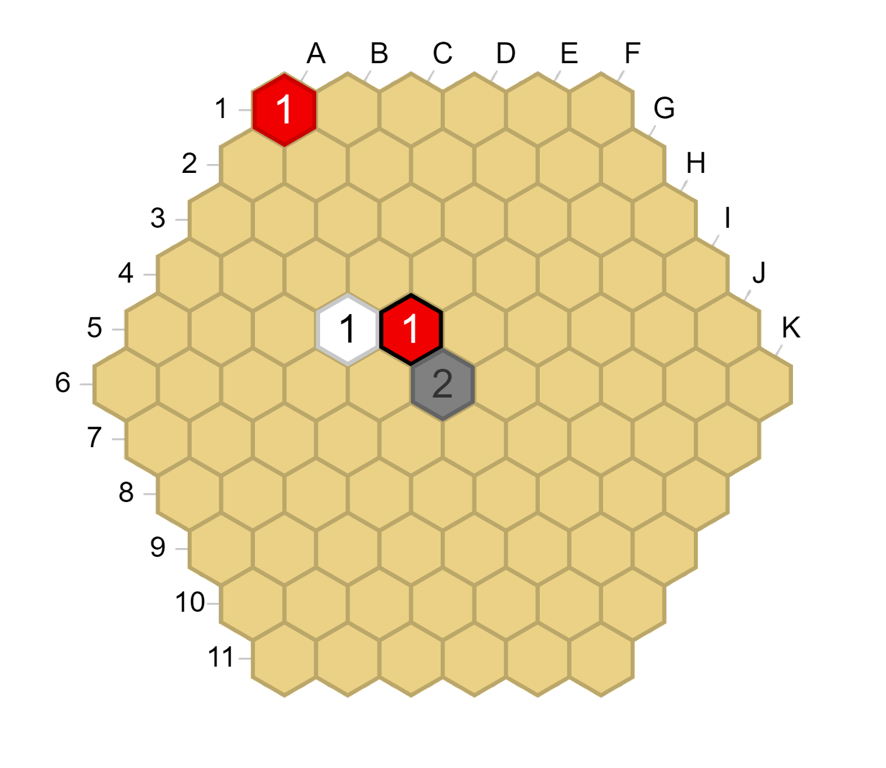
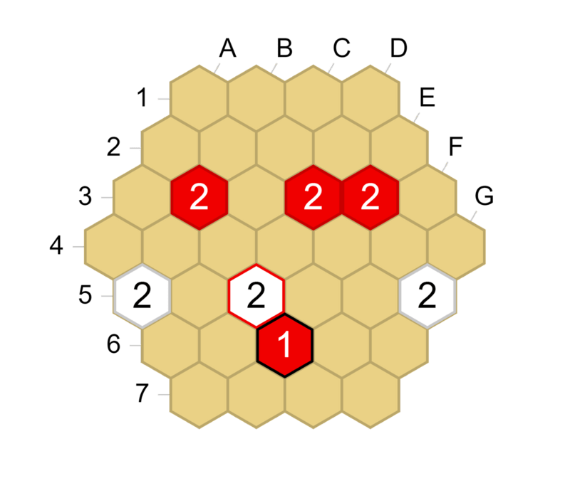
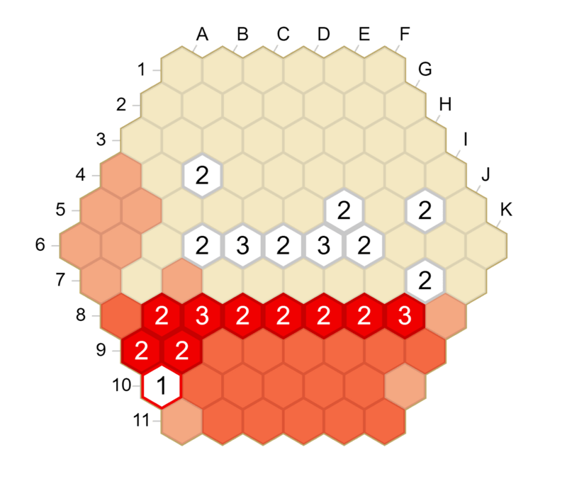
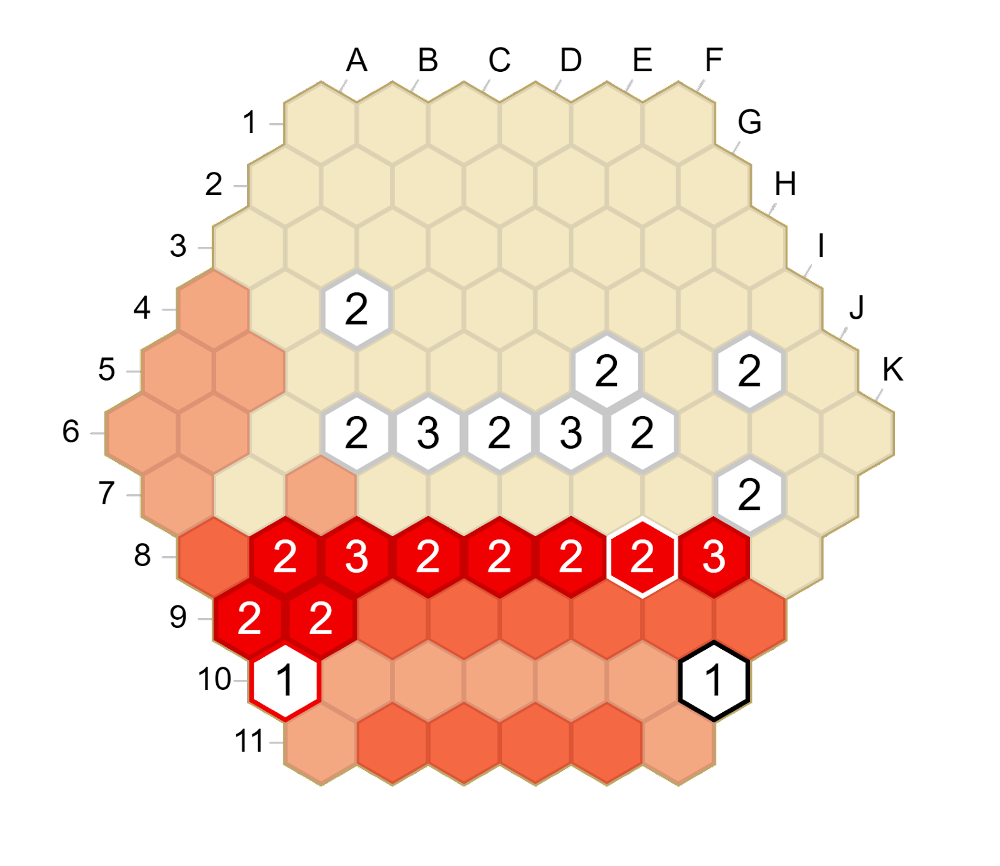
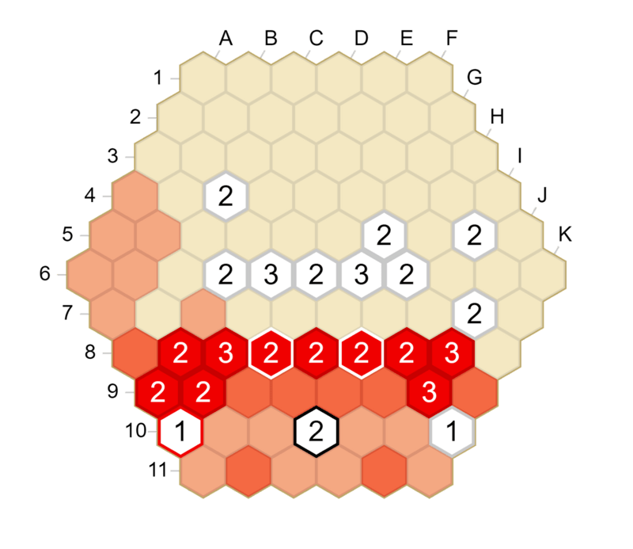
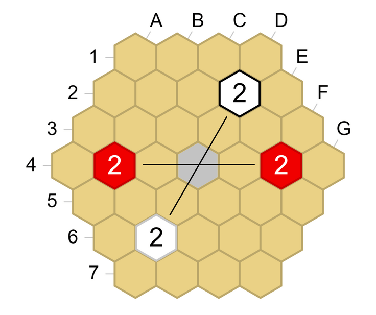
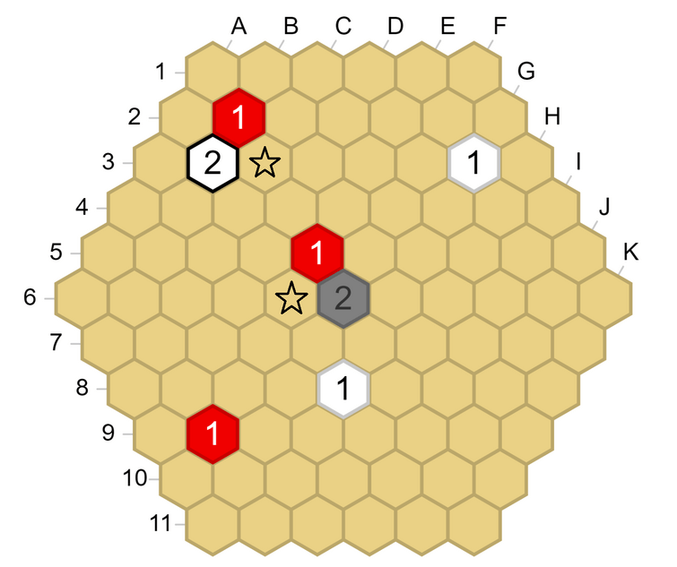
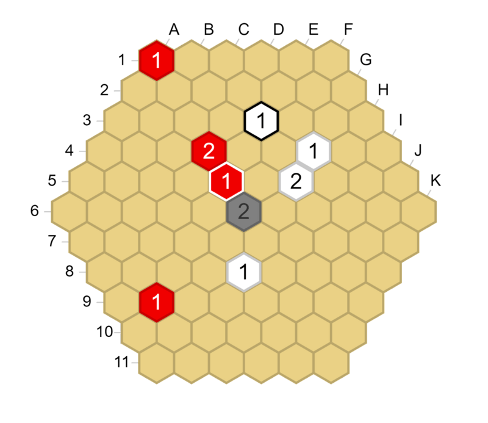
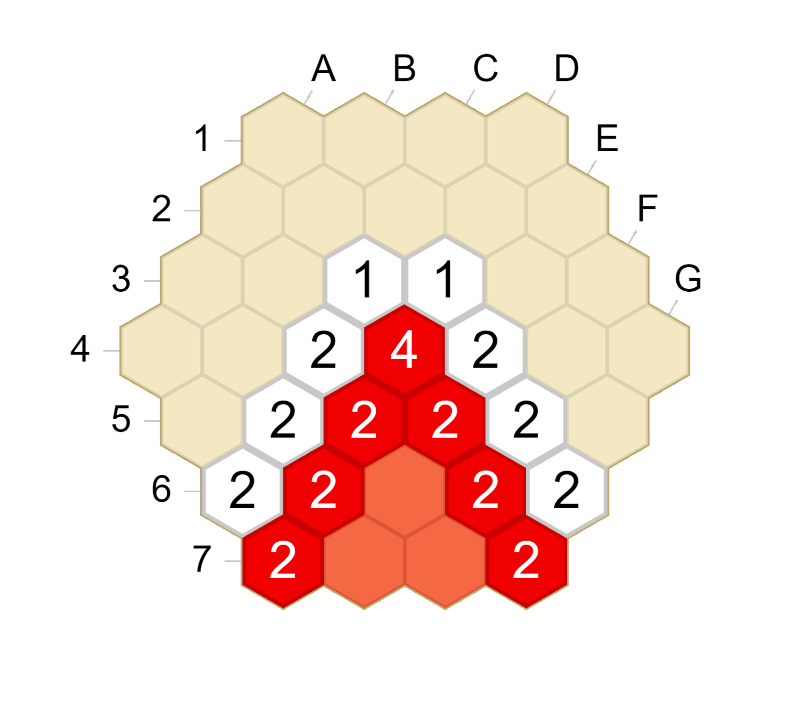
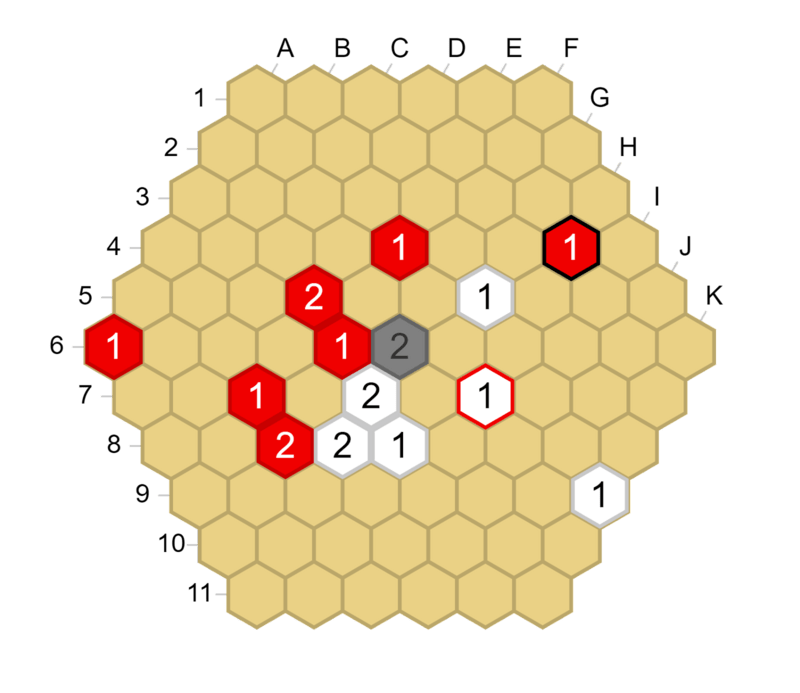

# Advice for Tumbleweed beginners

This guide’s purpose is to help you avoid common beginner mistakes in the game of Tumbleweed and provide some ways to structure how you think about the game. Some of the mistakes are moves that could look good visually but lose a stack almost instantly, others are “bad habits” that try to mimic shapes from other games (especially Go). Most of these were chosen because they occurred in a number of recent beginner games on BGA. The sections highlighting mistakes are completed by some sections on general principles of Tumbleweed. These should help you make sense of the flow of the game and give you a way to find some goals to achieve in a given position.

It is recommended to have played a few games before, and to have watched the following video explaining shields and parries: [Basic defense strategies in Tumbleweed](https://www.youtube.com/watch?v=b1q3ZtuE-cc)

## Contact 1-stack moves that don’t attack are bad

Playing a 1-stack adjacent to an enemy stack is usually a bad move if your 1-stack does not immediately threaten to capture it. For example, in the diagram on the left, Red just played E5. White can answer with E6, attacking E5 immediately, and Red has no way of saving the stack.



<--->



You should keep in mind that _1-stacks are weak when you place them_. You can make a 1-stack more solid later by adding more friendly lines of sight to it, but initially it will be very vulnerable. Generally, 2-stacks are better suited for agressive, contact moves (though they can fall quickly too if the initial attack is not impactful enough). However, as mentioned above, this does not mean you should disregard contact 1-stacks as a move entirely. If you play a contact move and it directly threatens to capture an enemy stack for example, your opponent will have to deal with the threat (if it is possible) before they are able to counterattack (see the diagram below, where Red plays E6).



<--->


Red E6 attacks D5. White has no time to play D6 or E5 to attack E6, because in that case Red would just capture D5. So Red E6 is a move that can be considered, and in fact here it can end up working very well.

## Be wary of your opponent’s “dead” stones

As the endgame approaches, there are often some 1-stacks of your opponent left in your territory, where you have two lines of sight or more on them. It can feel slow to capture them or to play in your own area, but it is often necessary to deal with these almost dead invaders. You should not underestimate how much damage they can inflict. This is because _stacks left on the board still provide extra lines of sight_ , and thus more move possibilities to your opponent. This is related to the fact that captures (= actually removing the enemy stack from the board) are especially important in Tumbleweed, much more than in some other games like Go. Capturing a stack has the added benefit of reducing the number of moves your opponent can make. Let us look at a position where a 1-stack that has no hope of living can be used.



<--->



After White K10, Red has to shield by playing J9, or White will capture I8 and break the wall. But after Red J9, White can play H10 or I10 for a strong double attack.



<--->


## The intersection of two links is a crucial point

As explained in the document on Shapes of Tumbleweed, links are segments between two friendly stacks that see each other. They are the fundamental building blocks of the game and should be at the center of your strategy. A situation where there is one crucial move that beginners often fail to make is the following diagram, where one of your links intersects one of the opponent’s links.



<--->


The two links intersect at D4. This is an urgent point to control for both sides. One possibility is to play there directly if the position permits it, another is to play a move like B2 or F6 to add a third line of sight on it. Let us look at a real-game example of this ([Tumblebot](http://34.233.90.87:8000/api/analysis/site) against itself), after 1. B2 G8 2. E5 G3 3. E9 B3.



<--->


The C3 and E6 hexagons are both at the intersection of a red link and a white link, so they are ideal candidate moves for both Red and White. The process of finding the most important point among these two is a bit more advanced, but roughly speaking E6 is more central, and if Red played C3 and let White play E6, Red might be overconcentrated in the top of the board and could be behind. So the best continuation from the diagram above is Red E6, White C3.

## Reinforcing is bad unless you have to

Reinforcing is usually bad unless it is your only option. For example, in the opening position below, Red’s E5 stack is attacked and it would be wrong for Red to reinforce it to a 2. Reinforcing defends against White’s attack and prevents the capture of E5 in the near future, but it does not do anything else, it’s a very passive move. A much better play is to parry, for example on C5 as in the diagram on the right below. This both defends E5 and opens new lines of sight, importantly the C5-I11 line. It also puts an extra defender on the C3 hex, which could be useful if White plays B3 next.



<--->



One rule of thumb is: instead of reinforcing a 1-stack to a 2-stack, look for a parry (put a third line of sight on it). And try to anticipate whether a 2-stack you place will have to be reinforced soon to a 3-stack, since that is usually not very efficient.

## The balance of development

This is less a single beginner mistake than a central point of the game (something that is actually found in many abstract games, especially territory games). You are constantly trying to hit a sweet spot between trying to claim a bigger area and making your zone of influence more solid. In Tumbleweed, there is actually a good indicator for this: the height of the stack that you are considering to place, because it indicates, by definition, how many lines of sight you have on that hexagon. For example, placing a 4, 5, or 6-stack is not efficient at all, because that hexagon was already solidly in your area, and this stack does not open up a lot of new lines of sight for further development.

You have to decide, at each move of the game, what is the correct way to proceed. Is placing a 1-stack greedy or just fast, efficient play? Is placing a 3-stack slow/inefficient, or a solid move making your position much safer? These are good questions to ask yourself in a lot of positions, and you will get better at answering them as you play more Tumbleweed.

## Prepare your shape in advance

We’ll end this small guide with the slightly more advanced topic of shape and more specifically angles. There are many subtleties and this is just an introduction, but it is very important to be mindful of it in order to get a feel for the flow of the game.

It would be great to be able to make a wall of 2-stacks spanning the whole board, but usually your opponent will not cooperate. As a result, you will be forced to make some angles in the shape of your areas. After you have played a few games you may notice that one type of angle is most common: an obtuse angle, which is more efficient than an acute angle.



<--->



In both diagrams, seven stacks are in the Red border (not counting the support 1-stack on F7 on the left), but the obtuse angle in the left-hand diagram is way more efficient at making territory than the acute angle in the right-hand one. In addition, an obtuse corner stone like the red 3-stack on C4 can be placed very naturally: Red only needs to have a line of sight along both sides of the wall (C6-C5 and D4-G4) and an extra support stack like the one on F7. Whereas the Red 4-stack on D4 in the right-hand diagram cannot be constructed “naturally” from the shape of territory Red will eventually achieve. An obtuse angle eventually needs to be at least a 3-stack, and an acute angle needs to be at least a 4-stack. You don’t always have to play exactly on the angle point, sometimes you just need to have enough lines of sight on it. This explains why it’s generally preferable to make obtuse angles instead of acute ones. Another very important thing to keep in mind is that _the angles of your shape are key hexes_. You should not forget about them during the game, and generally you should try to decide in advance which hexes you would like to use as the angles of your shape (or shapes if you have multiple groups on the board). Of course, you might have to change plans depending on what your opponent does, but it helps give your play more structure.

Let us look at a position from a game between testing_qwerty (Red) and komacchin (White) ([link to the game](https://tumbleweed.games/log/4160/15/)).



<--->



Red has just played H4, attacking the white 1-stack on H7. And White responds on H5, shielding H7 from Red’s attack. This is a multipurpose move. First, it opens up new lines of sight for White along the D1-K8 line. Moreover, it puts a third line of sight on G5. This way, if Red moves next to try to enclose White (like Red’s G4 in the game), White already has a solidified angle on G5.

