# Fundamental Shapes in Tumbleweed

## Link


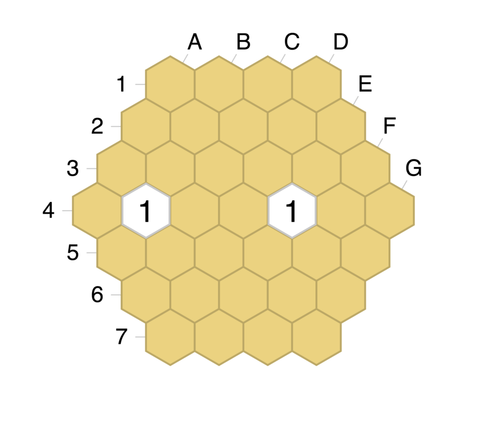
<--->


Links are lines of sight (LOS) between two friendly stacks. In the figure, C4 and D4 make up a link between B4 and E4. Stacks emanate LOS in the 6 cardinal directions surrounding them. If stacks owned by the same player can see the same space, their friendly lines of sight (fLOS) are added together to allow that player to make higher-valued stacks. Thus, links allow a player to build at least 2-stacks on those intervening spaces.

In general, lines of sight create stacks, new stacks create links, and later, links make up the network of pieces supporting each other. Connectivity is key: keep your own stacks strong and connected. Redundancy keeps a network strong, but can reduce influence. If a stack is connected via links to other friendly stacks, each link represents a fLOS protecting it. Even if a stack has a low value (1 or 2), sharing many links (4-6) makes it temporarily invincible. Connectivity is key: keep your own stacks strong and connected.

Short links are less vulnerable than long links for the following reasons. First, long links are more difficult to add fLOS to both stacks via triangles (it might not fit in the board or be blocked by enemy stacks). Second, a larger intervening space offers more possibility for enemy stacks to be placed there, cutting the link. There are other tactical reasons why shorter links are safer than long links, but similar logic applies.

However, longer links might allow a player to have more influence over the whole board,
especially if they are able to maintain control over them.

## Controlled versus contested spaces


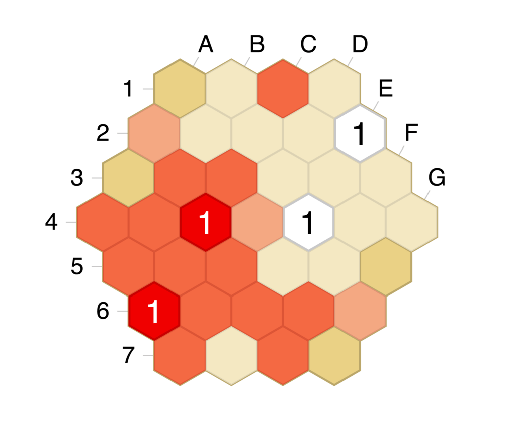
<--->


**Controlled spaces** are empty hexes in which one player has a majority LOS. If a player places a stack on an enemy-controlled space, then it could be immediately recaptured by the enemy (i.e. a simple suicidal move). Playing on a space where enemy lines of sight (eLOS) exceed fLOS is always bad, so it is a general rule of thumb not to play on enemy-controlled spaces. For instance, White shouldn’t place on E6 because White has 1 LOS there, while Red has 2 LOS there. Similarly, C2 is controlled by White (White has 2 LOS, while Red has only 1).

**Contested spaces** are empty hexes in which both players have equal lines of sight, and thus both players can make the same size stack there. Either Red or White can make 1-stacks on D4, A2, or G6, for instance.

Empty spaces are either controlled or contested, or simply **out of sight** if neither player can place there.

## Cutting point


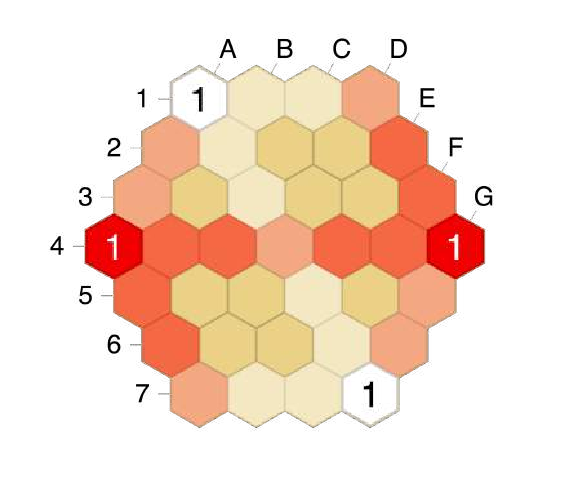
<--->


**A cutting point** is a contested empty space where a Red link intersects with a White link. Creating, playing on, and otherwise controlling these cutting points are a major aspect of tactics in Tumbleweed. In the diagram, D4 is a cutting point. Either player can play a 2-stack there to “cut” the enemy link. Either player could also play on D1 or D7 to add fLOS to D4. Discussion about cuts follows in the next page.

## Bridge one space jump controlling a cutting point


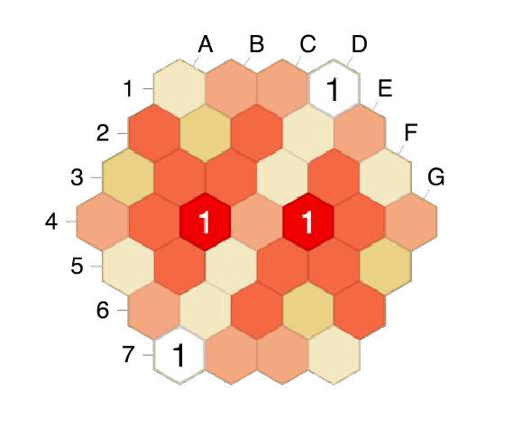
<--->


A **bridge** is the empty space between two linked friendly stacks that are one space apart. The tactical value of the bridge is most apparent when that space is contested.

Proximity of a cutting point to different stacks is important for determining who will control the flow of play around that space. If a player's stacks are both adjacent to the cutting point but the opponent stacks are across the board, it is not feasible for the opponent to cut because of an immediate counterattack.

In the diagram, if White plays D4, Red can immediately trap it by playing C3 or E5 followed by D4x. In a sense, Red has formed a **bridge** from C4 to E4 because of an implicit defense of D4 by proximity.

## Cut


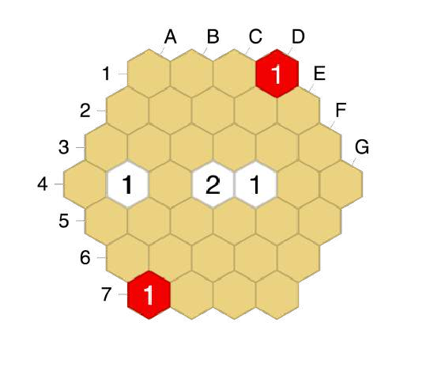
<--->


When a player plays at a cutting point,the move is called a **cut** and the stack placed is a **cutting stack**. Cutting links contests lines that were almost entirely controlled by the enemy, which can disconnect their network, and weaken their position.

Make sure you can anticipate the likely enemy response to your cuts.Think about if cutting is safe, and/or keeps tempo. Most cuts played during the opening and middlegame are usually 2-stacks. Most cuts, by definition, start with 2 eLOS trained on them, so these can usually immediately be counterattacked. If you cut, prepare to be attacked and think about how to follow up. For instance, if you can shield after the cutting stack is attacked, you might gain control over a portion of the enemy link.

Generally, if the cutting stack is large, it will be safer, and cutting links between smaller stacks is safer. If a 3-stack cuts, the enemy will be less incentivized to attack it compared to if it were a 2-stack. Cutting a link between small stacks with a large stack is more likely to work. On the contrary, cutting a link between large stacks with a 2-stack is not as effective. Additionally, cutting small links is more dangerous.

Playing cuts with an inherent threat are one way to increase the safety of your own cutting stacks. For instance, if cutting between two enemy stacks also threatens to capture one of them, it is less likely that the enemy can handle that threat while counterattacking. Also, if the cut threatens to capture both of them, then counterattacking becomes basically impossible as capturing either will remove eLOS.

Example: Puzzle B of Local Tactics in Tumbleweed (AGM expansion)

We will now take some time to discuss some cutting tactics. There are a few standard tricks to cut an opponent’s link, but they are of course very situational and you should figure out which ones would work in a given position before playing them, thinking about possible counterattacks your opponent could throw at you. The goal of the rest of this section is simply to present how cutting might be achieved.

A **double cut threat** consists in threatening two cutting moves at once, for example like in the following position.


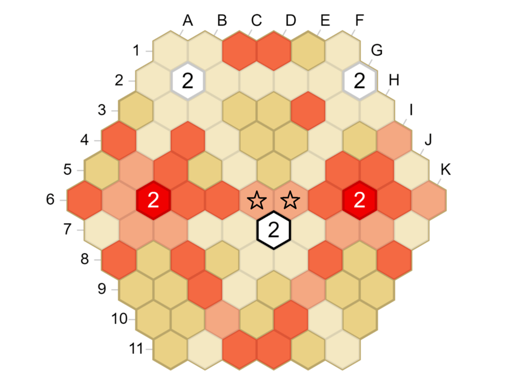
<--->


Here White plays G7 and threatens to cut the red C6-I6 link on both F6 and G6. Red cannot deal with both threats, and if, say, Red plays at F6 to block one of the two cuts, White cuts with an attack on F6. Note that this triangular pattern does not need to have a vertex directly next to the link. For example White H10 below works in the same way.


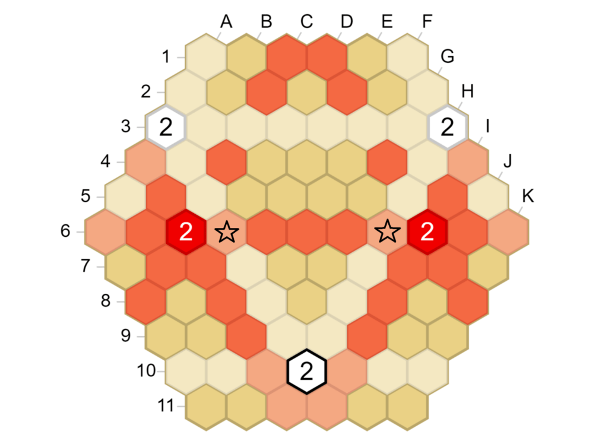
<--->


Another way of making a double cut threat is by playing the following « trapezoid » shape, like Red H7 in the following diagram.


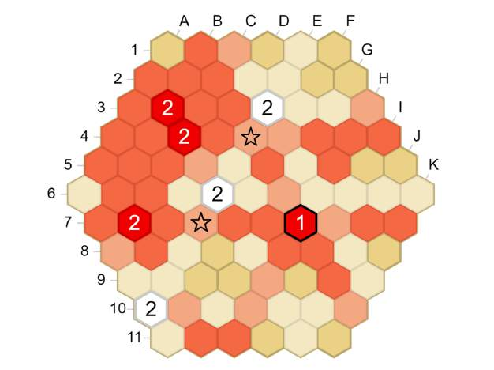
<--->


The situations arising from this kind of double threat might be less solid for the attacker than in the case of the triangle-shaped double cut threat, since the invading stone on H7 is only a 1-stack this time, Moreover, if White decides to play at one of the starred points, Red playing at the other will not come with an immediate attack. However, a move like H7 should usually be good.

There is also a « diamond shape » version of the double cut threat, which comes up a bit less often and requires the help of a side stone, as in White F8 below.


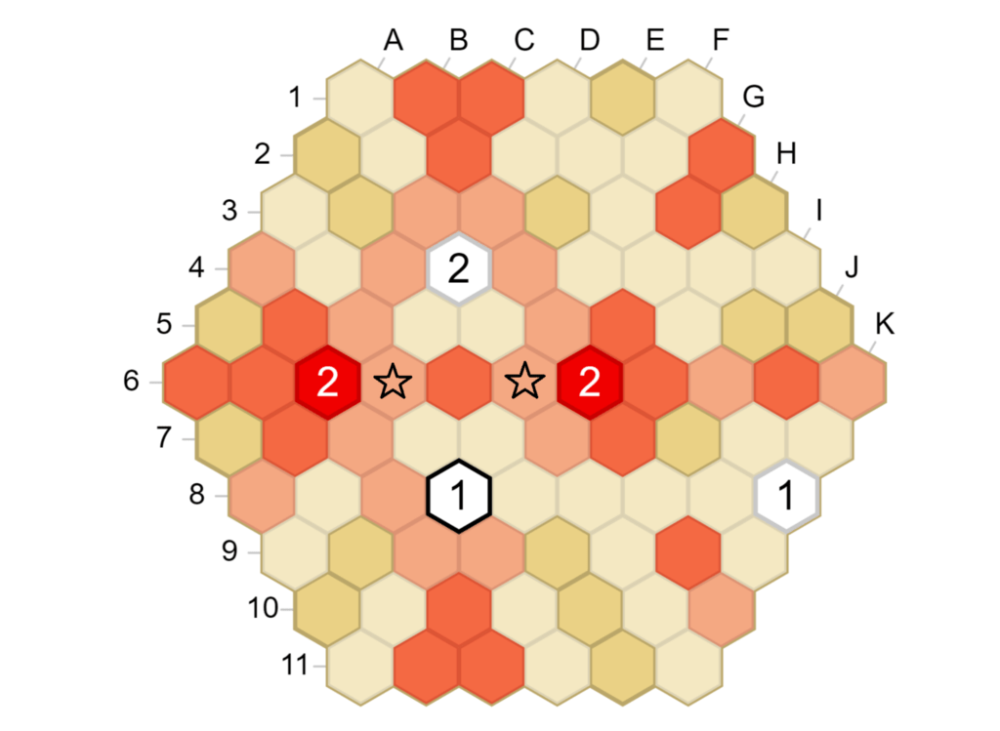
<--->


That is all for the double cut threat shapes we will cover here, but there are a couple other exotic ones that you might encounter.

Of course, when threatening two things at once, both of these things do not have to be a cut. A tactic that also comes up often is threatening both a cut and something else (for example, a stone, or another key hex).


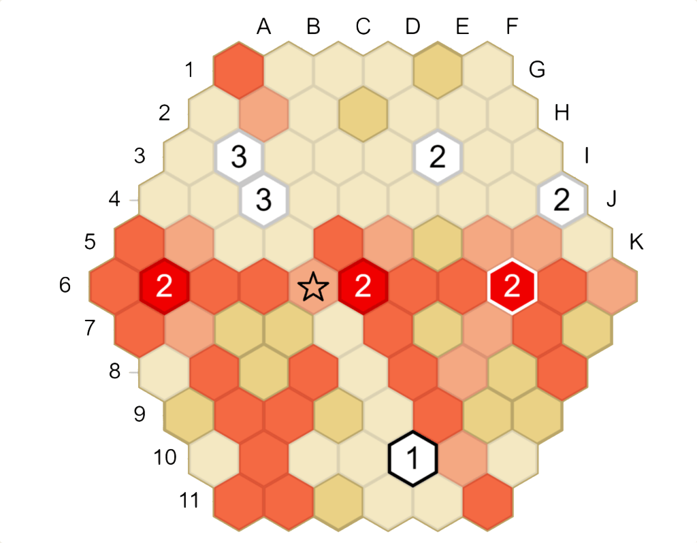
<--->


In this position, White has just played I10, and Red must choose between defending the I6 stack and preventing White’s cut on E6.

## Wedge a cut of a one-space link

We call wedge a move that cuts a 1-space link, like Red D5 in the following diagram.


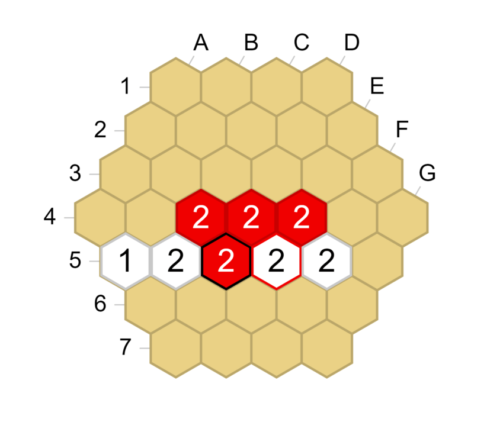
<--->


Unless the wedge attacks one of the two stacks of the link that it has just cut, it will usually fail, because the cutting stack is very vulnerable: there is no way to shield it from the two stacks it is cutting. For example, consider the position above and let’s imagine that there is no E4 Red stack. Then White can answer the wedge by attacking the E5 cutting stack, and Red would have no way to save it.


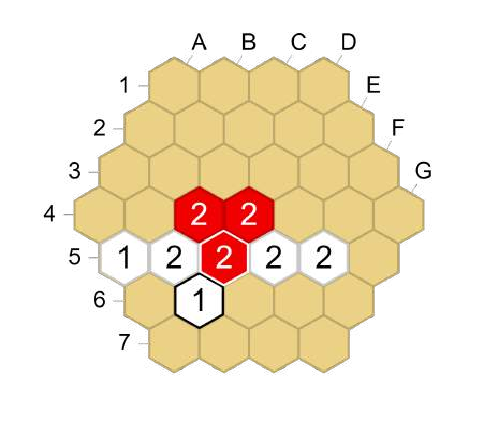
<--->


However, an interesting and instructive special case of wedge occurs at the edge of the board. This kind of edge shape often comes up during the endgame or when your opponent is trying to live with invading stacks, and it is useful to recognize it.


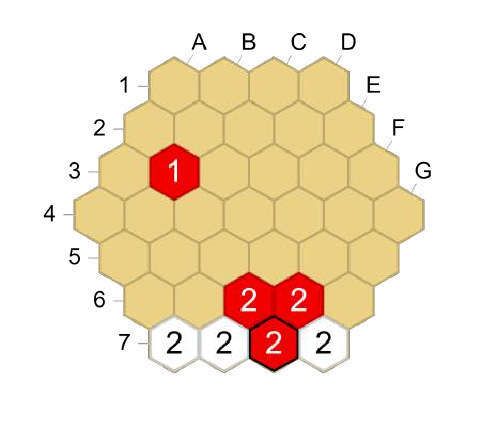
<--->


Red F7 breaks White’s connection and cannot be attacked by White. Breaking a link between 2-stacks on the first line is especially important (for example when you are getting invaded) because it can prevent them from making a living shape. Note that some less bulky versions of this edge wedge would still work for Red, as in the following diagram.



<--->


The red stack on F7 is not attackable by White. The key hexes that make this position hold for Red are the E6 and F6 hexes. This also illustrates the fact that shapes with acute angles (like the red triangle D5-F5-F7) are often safer at the edge of the board than in the center, because the angles of the shape can be attacked from fewer directions.

## Shield


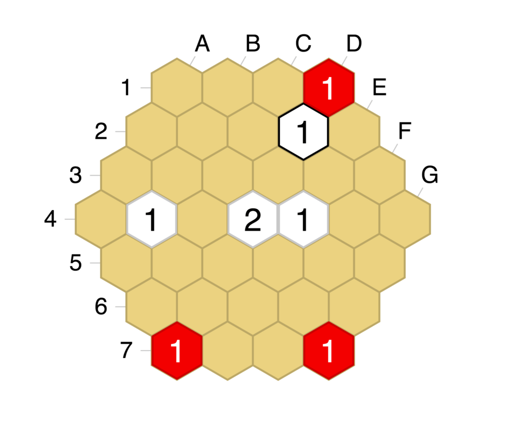
<--->


**Shields** are moves that defend against attacks by blocking eLOS on an attacked friendly stack. In the diagram, the White stack on D4 had 3 eLOS until White played D2, blocking the eLOS from D1.

Larger shields are more likely to protect a given stack, by forcing the enemy to spend many moves to reopen lines of sight from one direction. Smaller shields run the risk of getting attacked themselves, although in some cases even 1-stack shields are effective to gain enough tempo to conjure up counter attacks elsewhere that make the opponent's original attacking moves worthless.

If you can't make a large shield, it is often still possible to plan on making two shields in a row - one small shield that facilitates a larger shield along a different LOS next turn.

Shields deprive enemies of LOS – if given the option, extend your shield farther to push harder and gain more space. By extension, attaching to enemy stacks via shields can be a very useful resource to control the flow of captures, maximally block lines of sight, and over concentrate the opponent's position.

Basic examples of shielding can be found in: Local tactics in Tumbleweed puzzles #6, #7, and #8

## Guard adding a third LOS to a contested cutting point.


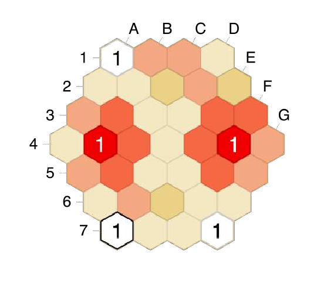
<--->


Instead of cutting, one can **guard** a cutting point by adding a third fLOS to a contested cutting point. Guarding moves indirectly control lines by disincentivizing opponent stacks along some spaces in the line. In the diagram, White has guarded D4 by playing D7, adding that third LOS to D4. If Red tries to play there, Red would be captured immediately.

The idea with guarding is to play a 3-stack on that point later, which will be more difficult to attack compared to a 2-stack.

It is usually good to take control of cutting points. Take control of multiple cutting points with a single move, if you can. However be aware that guarding fLOS can be blocked.

## Steal


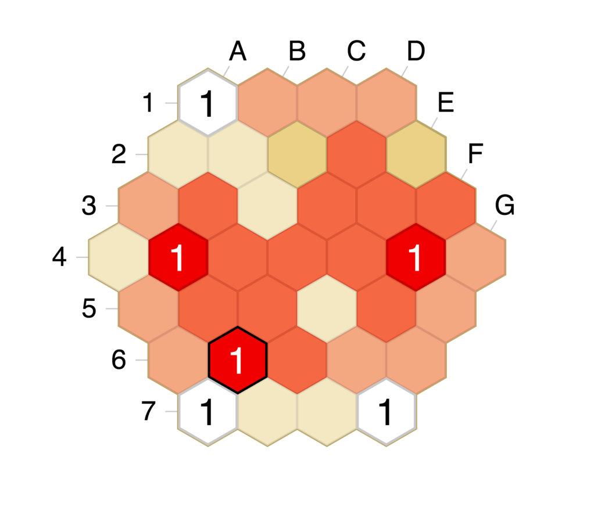
<--->


Anybody who guards a cutting point must be ready for the situation where the enemy **steals** back control by blocking their LOS on the space in question, while adding a third LOS in the process. In the diagram Red has stolen control over D4 by playing D6, blocking the White LOS from D7. This concept famously shows up in the size 6 Orthodox (1.A1 D5 2. E1 G5) after Red guards E5 with 3.E7 and White then proceeds to steal E5 via Test's move: 3...D4, blocking the Red LOS from A1.

Before D7 and D6 were played in this diagram, there was a single cutting point on D4, which represents a great deal of positions in early game Tumbleweed. After D7 was played, D6 was still contested, so Red could play it. Now, after Red steals D4 via D6, White cannot immediately re-steal back D4. Often, especially in the opening, when a steal occurs, it is not easy or even possible to re-steal the space in question. This is because the stealing move is by definition closer to the contested point than the first guarding move, and there are no more contested points. Finally, if White tries to add another guard to D4 from a different LOS, Red can simply play D4 directly as a3-stack. Because 3-stacks are much more difficult to attack (for instance, they are never suicidal) Red will control D4 for the time being,

## Pinwheel


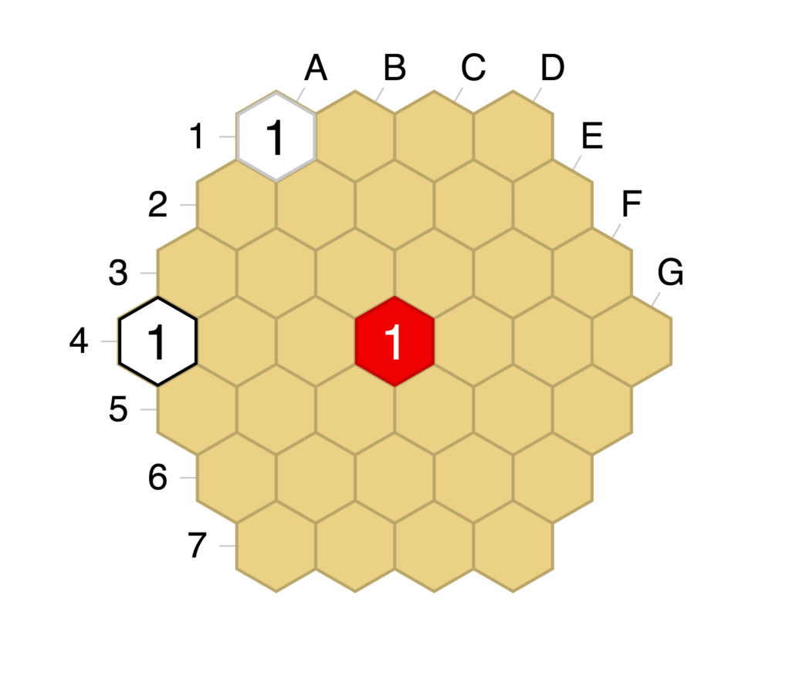
<--->
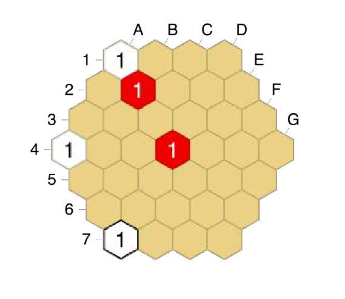
<--->
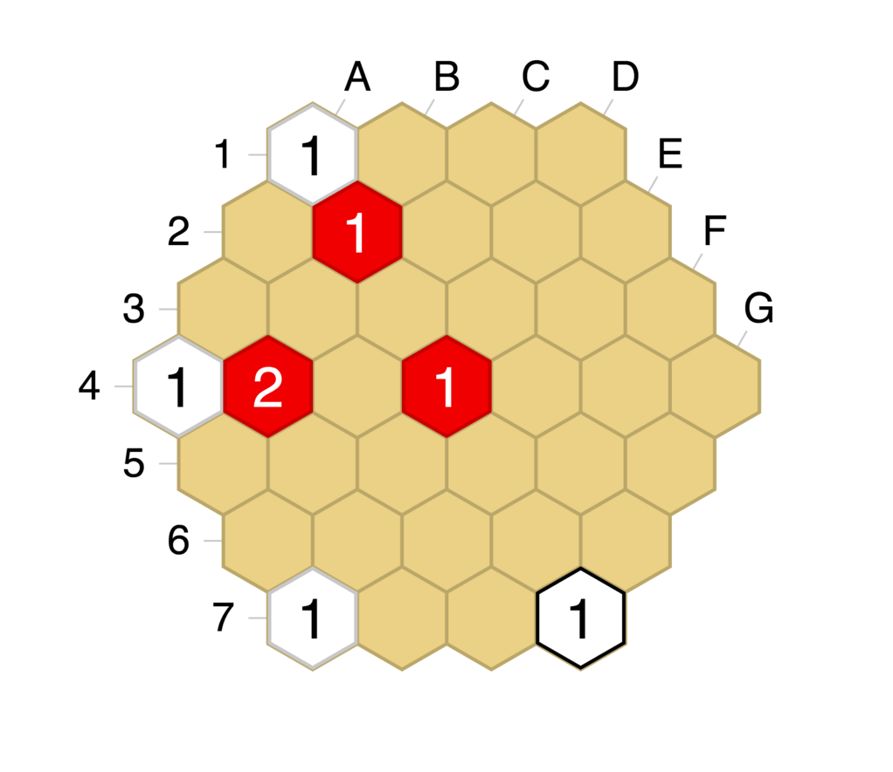


The term **pinwheel** refers to a series of moves in which one player continues attacking the same 1-stack or 2-stack for multiple moves in a row. If the defender places shields to remove eLOS, the attacker replenishes eLOS from different angles, resulting in a circle-like or spiral-like attacking pattern called a pinwheel. During this process, stacks played are often made possible by fLOS emanating from stacks placed last turn (for instance, see White’s sequence A1-A4-D7-G7).

The shields are, by definition, closer to the central defending stack than the attacking stones are.Often the defender gains many fLOS in the vicinity of the central stack. Thus, the defending player gains local solidity as long as the pinwheel continues. After a certain point, attacking the original stack becomes futile because of the strong defenses.

During a pinwheel, either player may choose to give up and move on to a different part of the board. While at the onset it is usually valuable to continue if the area is not populated, the question of when to stop attacking/defending is difficult.

If the defending stack is valuable enough to trigger many shielding moves, the attacking player can gain useful stacks on the outside. These produce outward-looking fLOS that can contribute to a successful attack elsewhere on the board.

Examples: Local tactics in Tumbleweed (AGM expansion) Puzzle H

## Wall - Walls are solid lines of stacks that block enemy LOS from a territory.


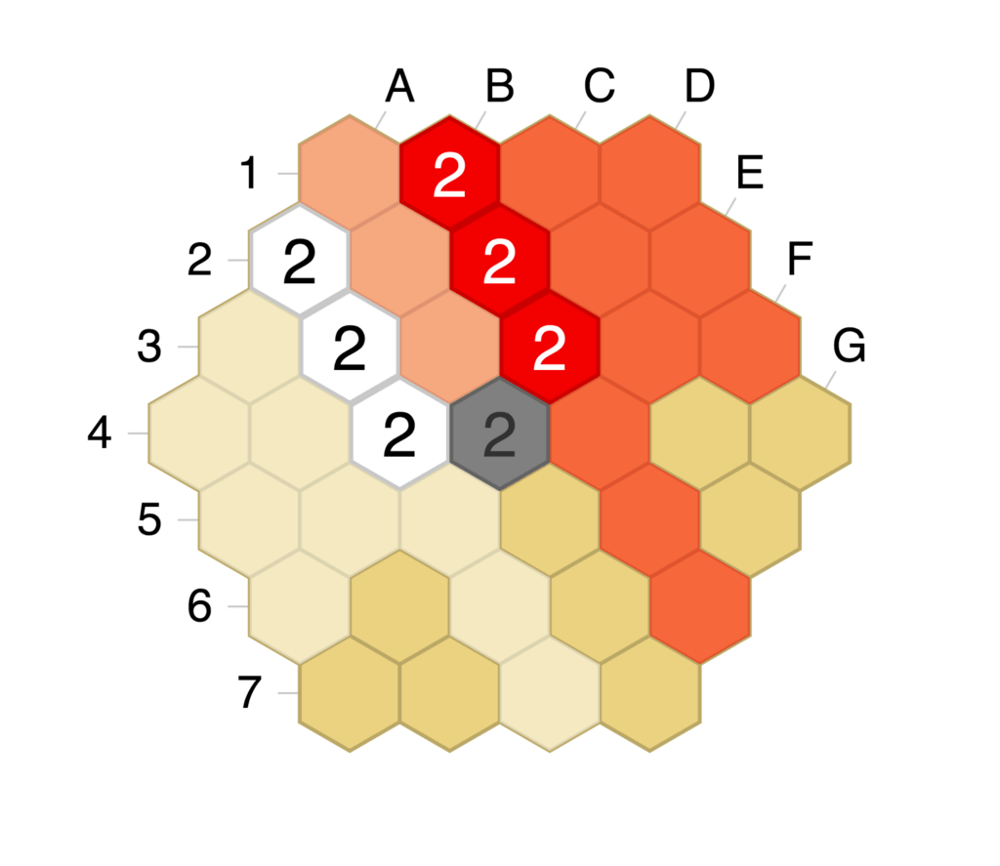
<--->


Walls can be extremely powerful because of how players can only place pieces within their own fLOS with the right placement of a wall, you can completely eliminate an opponent’s ability to even contest your control of an entire area. Indeed, walls are numerous in the final position of any Tumbleweed endgame, as territory is often not even countable until all spaces are hidden away behind walls. This is not always the case, as having majority LOS does not require walls, but it is the most common way to claim land in this game.

Strengths and Weaknesses of walls are many. Attacking walls can be done by apple picking (eating away from edges), getting underneath, or cutting before it closes.

## Apple picking


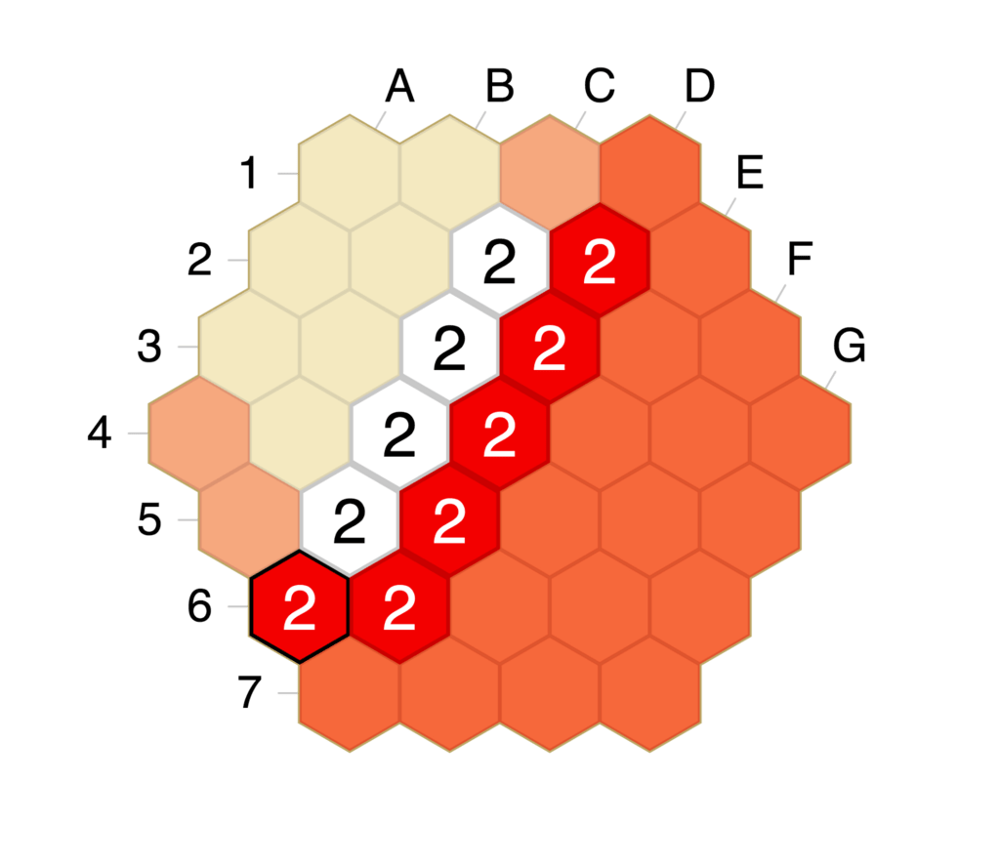
<--->


One way to take down a wall is by curling around it an attack called **apple picking**. As white, if this happens to you, I’m sorry to say you will lose at least 2 lines of territory. After Red 1.C6, placing a 3rd eLOS on C5, white cannot reinforce C5, and notice white also cannot add sufficient fLOS on C4 either, because after Red captures 2.C5x then C4 would have at most 2 fLOS, which isn’t enough to reinforce to a 3stack. If White had a 2-stack at C1, the best White could do regarding the lower side is something like B3 or A3, and then eventually reinforce C3. However, that won’t actually work well in this current position because Red also can play C1, apple picking from the North side too. In general it is advisable not to get yourself into this kind of situation, because here is where walls completely get torn to shreds. We called it apple picking because it resembles a farmer casually walking along a line of apple trees, removing their fruit one by one.

Examples: Local Tactics in Tumbleweed Puzzle #25

## Getting underneath a wall

Getting underneath a forming wall will allow you to attack it, potentially cut it before it closes, or at least get a foot in the door. Sometimes, you cannot curl around to attack a wall but must go underneath. Here is an example where Red can play 1.E4! This will at least partially tear down White’s wall. It was important to find the move which puts a 3rd LOS on a piece of the opponent wall, while adding new LOS to the inside of the opponent territory. After this, Red is contesting the D4 space as well as forcibly capturing E5. Consider the following position.


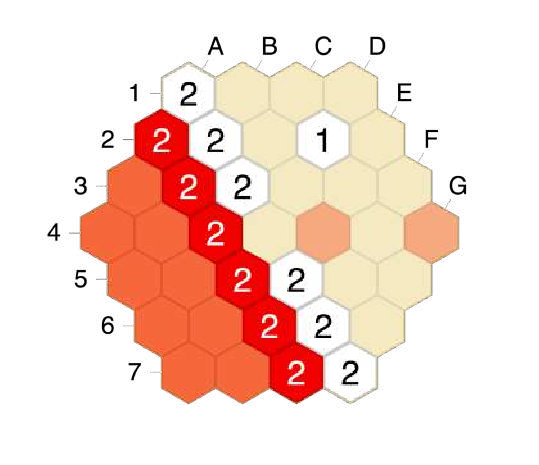
<--->
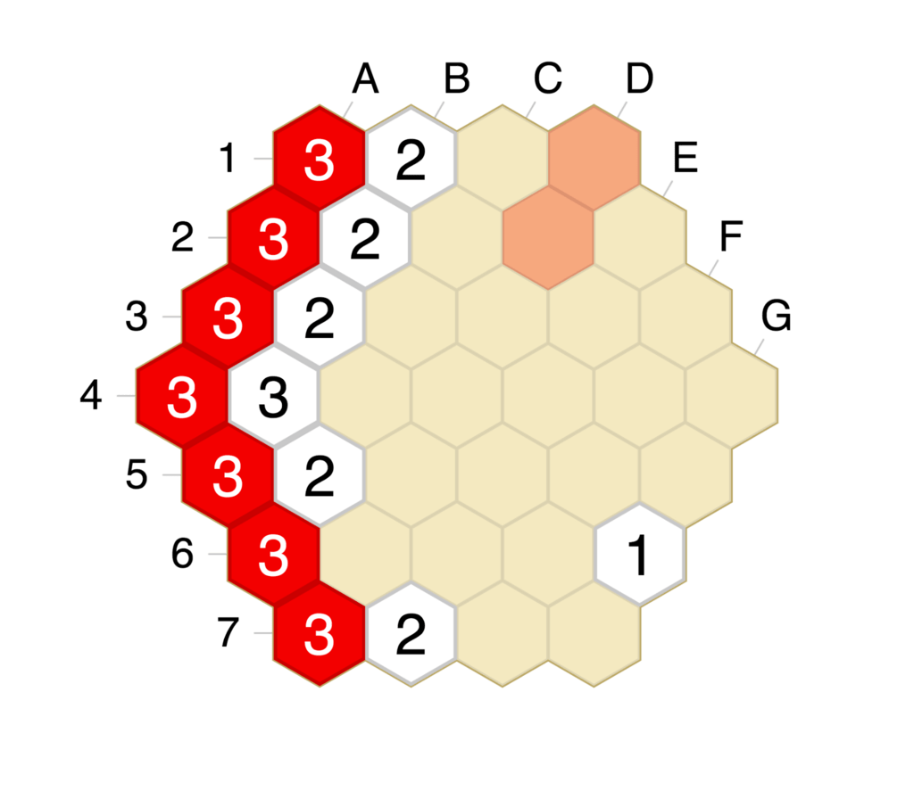


This is the kind of situation where you want to go underneath the wall (ideally it would have happened before it got to be this far, where Red only has basically one sensible move inside White’s zone).

Red can play D2! This move threatens two things: first, Red puts a third LOS on White’s 2-stack on B2, thus threatening to capture it. Second, Red threatens to either play on the newly contested D6, which would begin apple picking, or D5. Both of these moves also threaten to capture white’s 2-stack on C5.

Another way to attack a forming wall is to ensure that it contains multiple cutting points, so that if one gets closed up by the enemy, at least you can cut on the other position.

## Between the walls

It can happen that two opposing walls are not in contact with one another, but separated by an empty file. Here is an elementary example on a board of size 3.


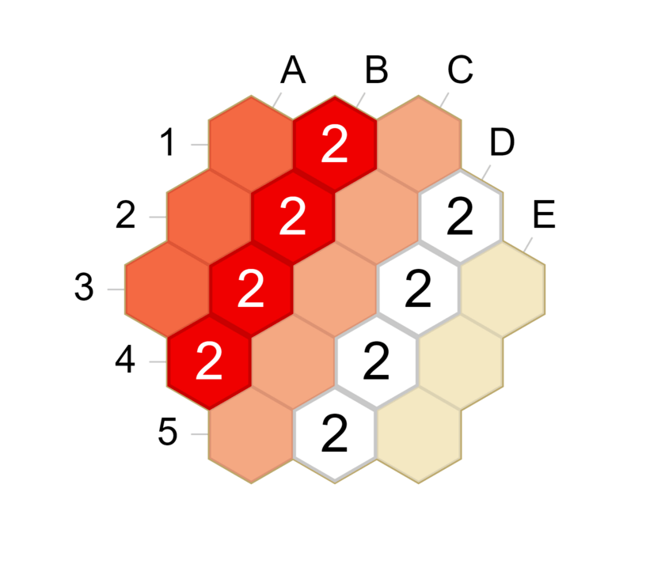
<--->


The C file might look like neutral territory, especially to Go players. However, the first player to play a move in it will claim the entirety of its points, with no possibility for the other player to contest them.


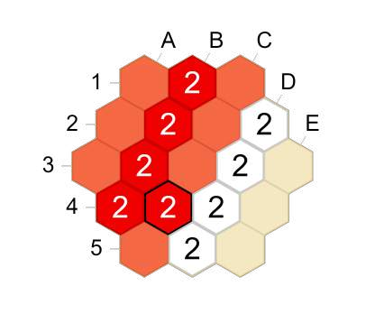
<--->


In some variants of these positions, White can recover a small number of points from the file, but the advantage for the first player to play in it stays very big. This concept appears regularly in games as the endgame starts, in many different forms (the space between the walls does not have to be a single file). It is easy to overlook these moves (especially as they usually lose the initiative) but it can be quite beneficial to make the first move in one of these neutral areas.

## Basic edge of the board endgame

One of the central ideas in Tumbleweed is that you don’t need to play on a hexagon to control it, you can also just add a line of sight on it. In fact, it is often safer to take this second option. This comes up often in all parts of the game but especially in endgame. For example, look at this example where two opposing walls are approaching the edge of the board (White to play).


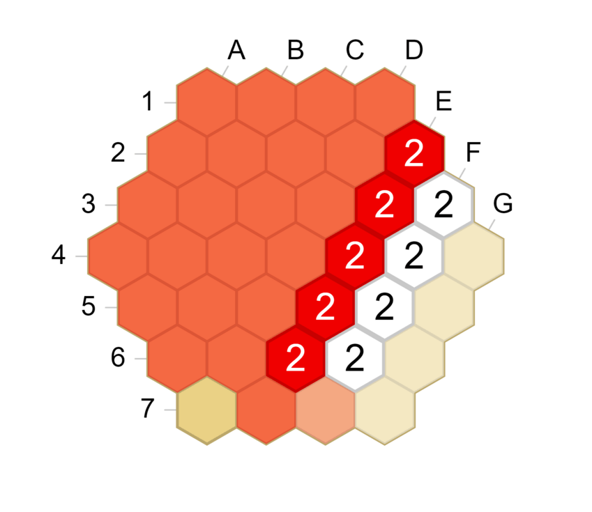
<--->


White does not want Red to curl around the white wall, since Red playing F7 would initiate some apple-picking. But White should not play a 1-stack directly at the border between Red and White on F7, because in that case, Red would play E7, and White would have no way of defending F7 (and even F6). The correct play here for White is G7 instead.


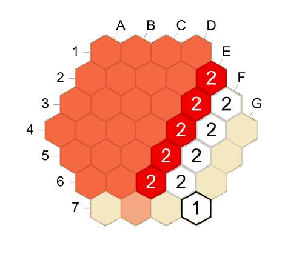
<--->


Now if Red plays E7, White can simply play a 2-stack on F7 and White’s position is safe.

## Parry


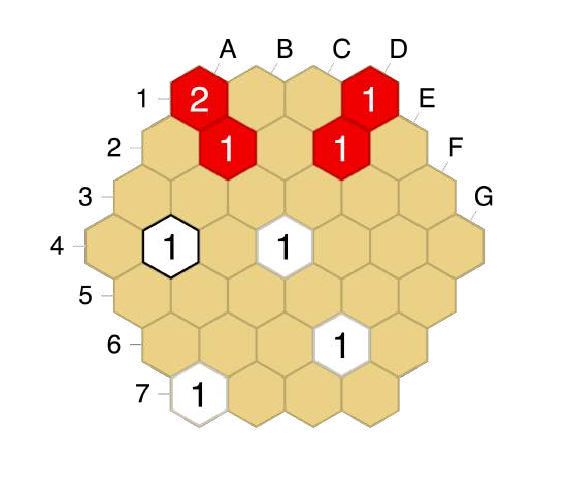
<--->


Instead of shielding, one can also increase fLOS on a 1-stack to defend a stack under attack. Usually this means putting 3 fLOS on a 1-stack that has 2 eLOS. The key is to make enemy captures suicidal.

In the diagram, Red can technically capture D4x. However, that move would be suicidal because White’s previous move B4 added a 3rd fLOS to D4 (in addition to the two fLOS on D4 emanating from D7 and F6).

More examples:
- Local tactics in Tumbleweed Puzzle #26
- Local tactics in Tumbleweed (AGM expansion) Puzzle A
- Local tactics in Tumbleweed (AGM expansion) Puzzle E

## Pre-parry - A non-cuttable move in LOS of a friendly 1-stack that has 1 fLOS and 1 eLOS

Because the parry is adding the 3rd LOS to a 1-stack, attacked with 2 eLOS, the pre-parry is setting up for the parry. It is important that a pre-parry is non-cuttable because otherwise Red would just cut and the attack would no longer be defensible by a parry.


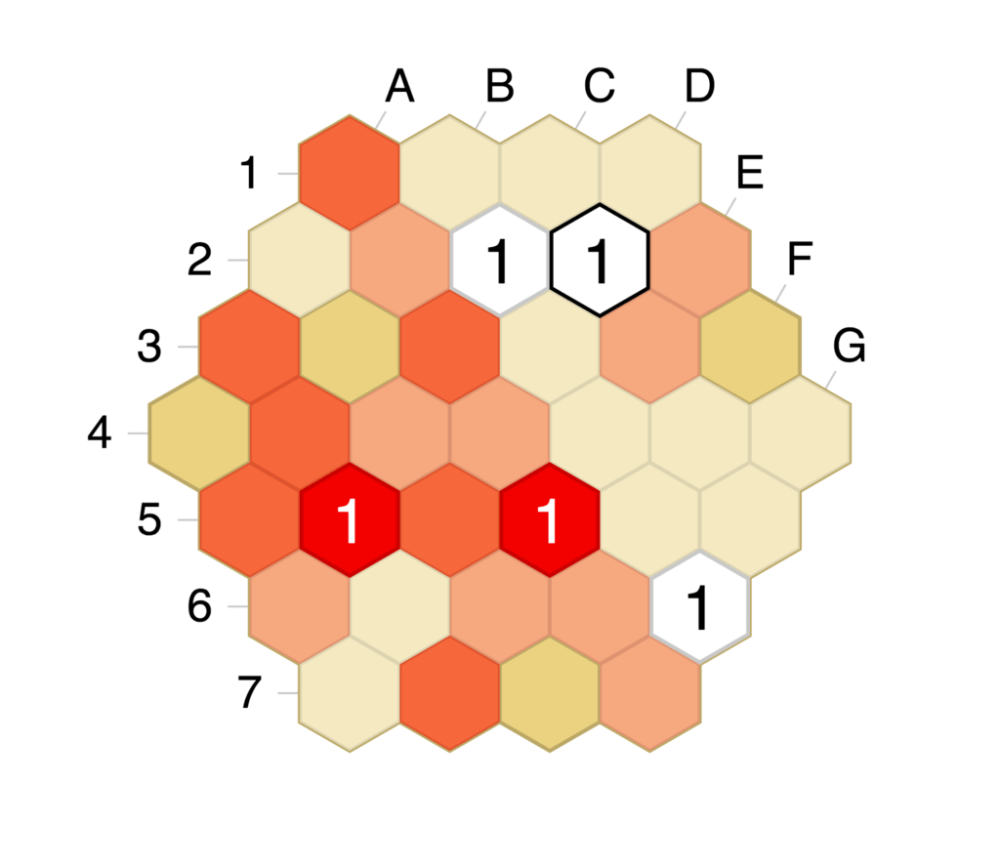
<--->


Here, Red just played 1.C5 White has responded with 1...D2. This adds a second fLOS to C2. If Red now tries to attack C2 using a move like 2.B2 ?? White will immediately counterattack: 2...B1! This move adds a third fLOS on C2, which makes a Red capture of C2 suicidal. Therefore, Red cannot capture and instead must deal with the hard fact that the B2 stack is now under severe attack. It was because of this move D2 (or other pre-parrying moves that were possible, like E2 or C1) that would make the actual parry possible, in case Red decides to foolishly attack.

## Trap - a forcible capture

A forcible capture or trap is an attack on an enemy stack that leaves no way for the opponent to save it. This means there is no possibility of shielding, parrying, or capturing one of the attacking stacks. Some of the clearest examples of this are contact plays.


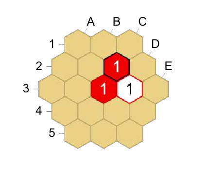
<--->


Red plays C2, trapping the D3 stack, and can capture it next turn. Note however that if White had two lines of sight on D3 (for example if there were white stacks on E4 and D5) White could parry by playing D2 or E3. There can be subtleties in trapping a stack via contact plays, but at least shields are not involved in calculations so it is usually easier to figure out how to proceed.

In a more general case, trapping a stack by non-contact plays involves preventing the shields the defender could use. This means finding an attacking move that controls the potential shield spots. For example, let us look at the following position.


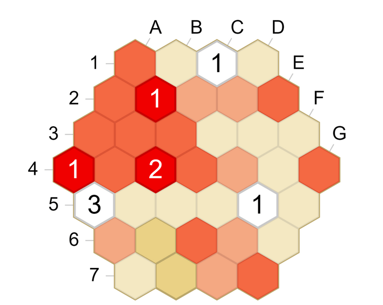
<--->


To attack the white stack on C1, Red has two moves: A1 and D2. Playing A1 would allow White a 2-stack shield on C2. But a Red play at D2 puts a third line of sight on C2, taking away White’s potential shielding move, trapping C1.


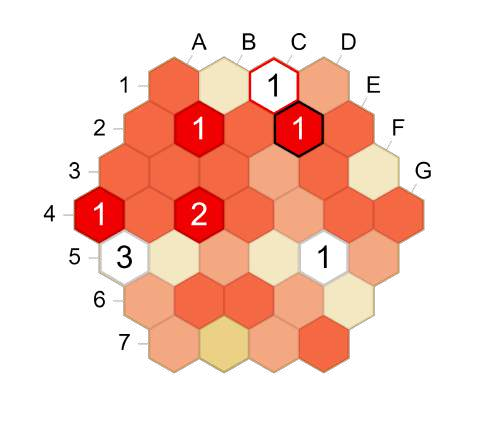
<--->


A useful way to spot this kind of move that prevents shields is to look at the potential shield spots for your opponent, then look at the points that see both these shield spots and the stack you want to attack.

## Snapback - delayed forcible capture or recapture


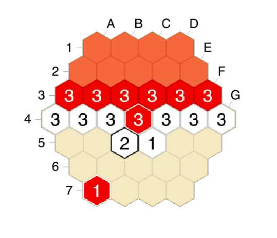
<--->


Some captures are simply not sufficient for defeating a wall. Here I want to show you that White’s wall apparently has a defect in it, on D4. Red can capture 1.D4x and replace it with a Red 3-stack. Seems good, right? However, This is a case of a snapback. After 1.D4x D5, Red’s 3-stack sees 4 eLOS and will soon be recaptured no matter what. The capture can happen but it just “snaps back” to the original owner. This concept is useful for determining if it is worth spending a move in a certain area. “If the opponent captures, will I be able to force a re-capture without doing anything right now?” If you can spot a similar snapback sequence, the answer is possibly yes.


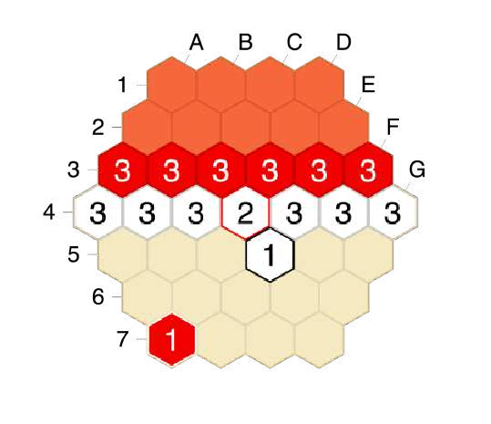
<--->


Examples: Local Tactics in Tumbleweed puzzle #14, #30, #31, #43.

## Curling - a type of forcible capture

The snapback made a famous appearance in one variation of the size 6 Orthodox (reproduced here on size 5). In this example, White will curl around the recently captured space and Red will have no chance to keep the recently captured stack.


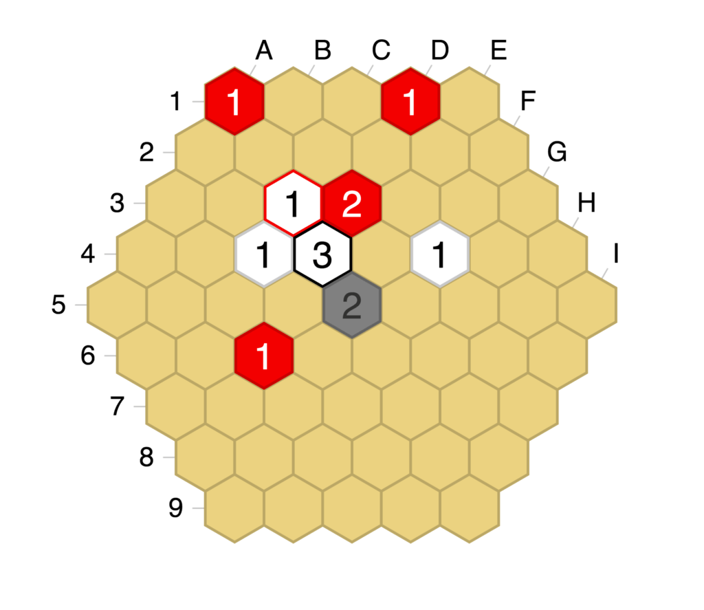
<--->


The sequence to lead up to the diagram was 1. A1 C4 2. D1 F4 3. D6 C3 (Test’s guarding move) and then Red played 4. D3 to attack C3. In response, White has just played 4...D4 in the diagram. It looks like it doesn’t defend anything at first, right? But actually, after Red 5.C3x White can play 5...B3! A snapback. Red cannot keep B3 for himself, as he will not be able to add fLOS or reinforce quickly enough, and White will recapture at White’s convenience.

Examples to see how this plays out in the Orthodox:

- https://tumbleweed.games/log/4064/10
- https://tumbleweed.games/log/3907/10
- https://tumbleweed.games/log/907/10
- https://tumbleweed.games/log/639/10
- https://tumbleweed.games/log/411/10
- https://tumbleweed.games/log/2508/10
- https://tumbleweed.games/log/2490/10
- https://tumbleweed.games/log/2479/10
- https://tumbleweed.games/log/2432/10
- https://tumbleweed.games/log/2319/10

## Anchor

One can use temporary sacrificial moves when possible to increase your lines of sight in an area to gain more options. Take for example, Atari’s brilliant puzzle #35 from the Local Tactics in Tumbleweed puzzle book (red to move and win, difficulty medium).


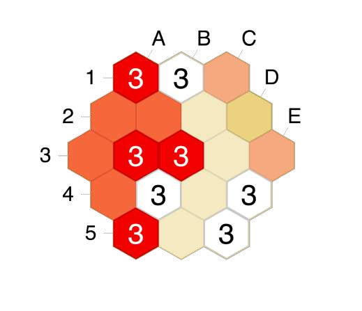
<--->


The answer is a series of Anchors. First, an initial sacrificial move C1 basically will do nothing but allow Red to gain fLOS on D2. Then, In turn, the sacrificial move D2 allows Red to gain enough LOS to threaten both C2 or D5, ensuring Red has enough points to win. Both of these moves are anchors because their purpose was to provide LOS elsewhere rather than to live.

More examples in the puzzle book:

- Local Tactics in Tumbleweed Puzzle #45
- Local Tactics in Tumbleweed Puzzle #47
- Local Tactics in Tumbleweed Puzzle #67
- Local Tactics in Tumbleweed Expansion Puzzle C

## Cut + Shield

Who controls a line can later build a wall. Thus, securing cuts is an important part of Tumbleweed tactics. Cuts that have a follow-up shield can be a powerful way to disconnect enemy links and prevent the formation of their walls, while helping your own walls. Take for instance the following example:


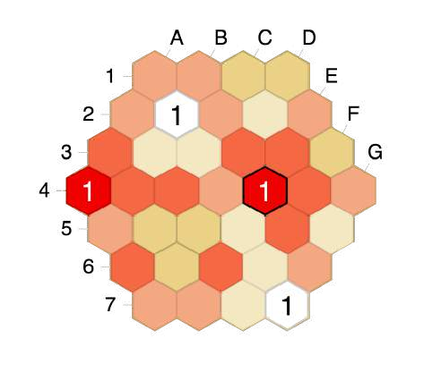
<--->
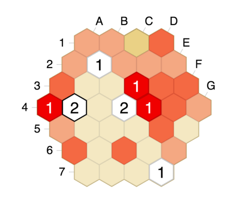


D4 is the contested hex of a cross-cut between a red link and a white link. Whoever plays there first will probably get attacked, but if the cutting stack can manage to survive, then they will control this line. After White cuts 1...D4, red can attack via 2.D3 but White can now secure the cut with a shield on 2...B4.

Now, this link is controlled by White. However, the link is not as magnificent as it was before, stretching only from B4-D4, where previously Red (mostly) controlled a link from A4-E4. However, this is better for White compared to the situation if Red would have played first on D4, leaving White with little to no recourse. Often a player is presented with multiple options for cutting links, and the big strategic question is which to cut, since usually cutting gives local benefits (shown in this example).

## Distance and strength of the linked stacks affect the tactical safety of cuts.

Next we show an example of how cutting is not always safe. Let’s say it is white to move in the following setup. Here, Red is closer to the hot spot than before, and the Red stacks are taller than before:


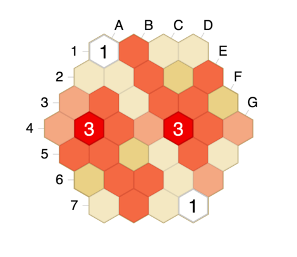
<--->
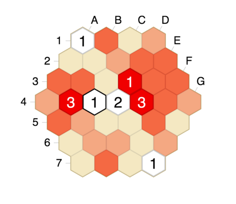
<--->
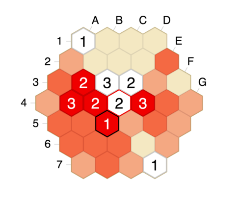


Now, white can cut on D4 just like before, but here Red can fight back strongly and reconnect by force.

After 1...D4 2.D3 C4 the 1-stack shield is forced to prevent the capture, and it is much weaker than before. This is because the White stack is farther away than before, so a strong shield cannot be made. Still, it takes a few extra moves for red to break White’s newfound links.

3. D6 is probably the less efficient option for Red here, because after ...D5 White has plenty of defensive options to complicate the situation (however it looks like Red can indeed still break the link if it is necessary).

3. B3 attacks the shield on C4, threatening a follow-up trap of D4. White can wriggle 3...C3, attacking D3 to relieve the pressure on D4, but it is not enough. 4.C4x D3x 5.D5 still traps D4 and in the end the cut is regained by Red. Note that if E4 was a 1-stack instead of a 3-stack, White would simply capture it and win this local skirmish.IfE4 was instead a 2-stack, White would curl around with E3 and prepare to capture it later.

3. C5 also works similarly for Red to fight back against the cutting moves of white in this situation.

## Examples from real tournament games

**(and let’s gather more examples!)**

- Cut - https://tumbleweed.games/log/4170/19 (cutting the link between I6 and I10)
- Bridge - https://tumbleweed.games/log/4173/8
- Shield - https://tumbleweed.games/log/4173/9
- Pre-shield - https://tumbleweed.games/log/4165/5
- Guard - https://tumbleweed.games/log/4171/11 (RedGuards I7)
- Steal - https://tumbleweed.games/log/4174/23 (Red steals control over L7)
- Pinwheel - https://tumbleweed.games/log/4273/79 (Red attacks G11 continuously)
- Wall - https://tumbleweed.games/log/4164/28 (Blocking eLOS to the lower left)
- Apple picking https://tumbleweed.games/log/4214/51 (this wasn’t too effective but it is still apple picking)
- Getting underneath a wall - https://tumbleweed.games/log/4269/54
- Parry - https://tumbleweed.games/log/4234/35
- Pre-parry - https://tumbleweed.games/log/4172/22 (making I10 nearly invincible)
- Snapback - https://tumbleweed.games/log/4269/95 (Red traps C4 with D4)
- Curling - https://tumbleweed.games/log/4165/48 (N8 curling around and trapping M8)
- Anchor - https://tumbleweed.games/log/4269/50

